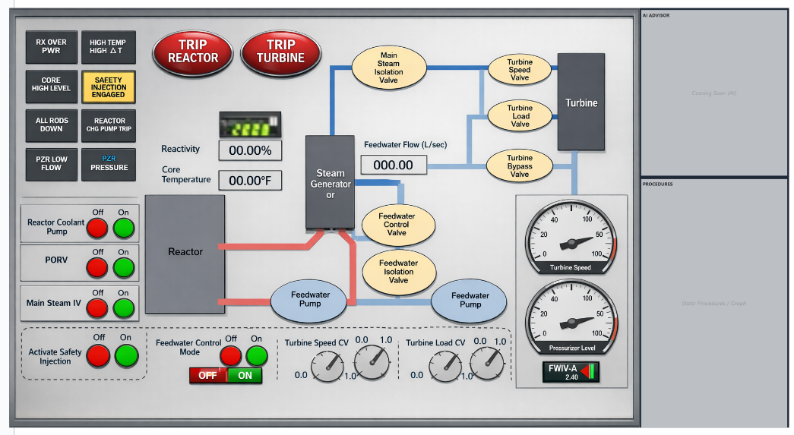

# NPP Web Simulator (LOFW Prototype)



## 1. Project Context & Objectives
**Goal:** Develop a **Web-based Nuclear Power Plant (NPP) Simulator Prototype** specifically for the **Loss of Feedwater (LOFW)** scenario.

### Why Web-Based? (2026-01-18 Context)
- **Accessibility:** We are building a prototype to be tested by various industry partners. Distributing an `.exe` file creates friction and security concerns for decision-makers.
- **Ease of Testing:** A web link allows immediate access for evaluation.
- **Scalability:** If adopted, the core logic can be ported to a desktop application or expanded as a full web platform.

### Design Philosophy (2026-01-14 Context)
- **Simplified Interface:** We explicitly rejected using the RANCOR system directly because:
    1.  It is overly complex for our specific testing needs.
    2.  We need a generalized panel design that can be easily understood by non-experts.
- **Focus:** Loss of Feedwater (LOFW) scenario.
    - Cause: Automatic valve control failure or pump failure.
    - Resolution: Rapid shutdown (Reactor Trip) if manual control fails.

---

## 2. System Architecture

### Tech Stack
- **Frontend:** React + Vite + Zustand (State Management).
- **Visualization:** Canvas/SVG for the Plant Mimic.
- **Backend:** (Optional for MVP) Python/FastAPI for advanced log storage. *Initially, logs will be handled client-side.*

### Screen Layout (4-Split Design)
Based on the January 14th design decision, the screen is divided into 4 quadrants:

| Location | Component | Description |
| :--- | :--- | :--- |
| **Top-Left** | **Status/Display Panel** | **(Read-Only)** Simplified RANCOR-like mimic. Shows system status (FW Flow, SG Level, Reactor Power). |
| **Bottom-Left** | **Control Panel** | **(Interactive)** Operator controls. Toggles, sliders, and trip buttons. |
| **Top-Right** | **AI Advisor** | *(Placeholder)* Future space for LLM-based decision support. |
| **Bottom-Right** | **Procedures** | *(Placeholder)* Interactive procedures and Knowledge Graph visualization. |

---

## 3. Simulation Logic ("Fake Physics")
The physics model is designed to support **operator training** and **decision-making analysis**, not engineering-grade thermal hydraulics.

### State Variables
- `fw_flow` (kg/s): Feedwater Flow Rate.
- `sg_level` (%): Steam Generator Water Level.
- `sg_pressure` (MPa): Steam Generator Pressure.
- `reactor_power` (%): Core Thermal Power.
- `turbine_speed` (rpm): Turbine rotation speed.

### Dynamics Equations (Specs)
The simulation loop runs at **10Hz**.

1.  **Feedwater Flow:**
    ```javascript
    fw_flow = k * fw_pump_on * fw_iv_open * fw_cv_position * (1 - fault_severity)
    ```
2.  **Steam Generator Level:**
    ```javascript
    // Change in level is Flow In minus Steam Out
    sg_level += a * fw_flow - b * steam_out
    ```
3.  **Steam Out:**
    Derived from `reactor_power`. Drops to 0 if MSIV (Main Steam Isolation Valve) is closed.

### Alarms
- `FW LOW FLOW`
- `SG LOW LEVEL`
- `RX OVER POWER` (Optional)
- `HIGH ΔT` (Optional)

---

## 4. Logging & Knowledge Graph Integration
A critical requirement is generating high-quality logs to build a **Knowledge Graph** of operator behavior, procedures, and regulations.

### Log Structure
1.  **Event Logs (User Actions):**
    -   `timestamp`: ISO String
    -   `action_type`: e.g., `TOGGLE_PUMP`, `SET_FW_CV`, `TRIP_REACTOR`
    -   `target`: Component ID
    -   `value`: New value (e.g., `0.65`, `OFF`)
    -   `user_id`: Session Identifier
2.  **State Snapshots (Periodic):**
    -   Captured every 1 second (1Hz).
    -   Contains all State Variables (`fw_flow`, `sg_level`, etc.) and active Alarms.

---

## 5. Development Roadmap

- [x] **Phase 1: Foundation**
    - Project setup (React/Vite).
    - "Fake Physics" implementation (LOFW specific).
- [x] **Phase 2: UI Implementation (Current)**
    - Implement the 4-Split Layout.
    - Build the Status Panel (Mimic) and Control Panel.
- [x] **Phase 3: Logging & Export**
    - Ensure JSON log export meets the Knowledge Graph requirements.
- [ ] **Phase 4: Advanced Features**
    - AI Advisor integration.
    - Procedure digitization.

## 6. How to Run
```bash
# Install dependencies
npm install

# Start Development Server
npm run dev
```
