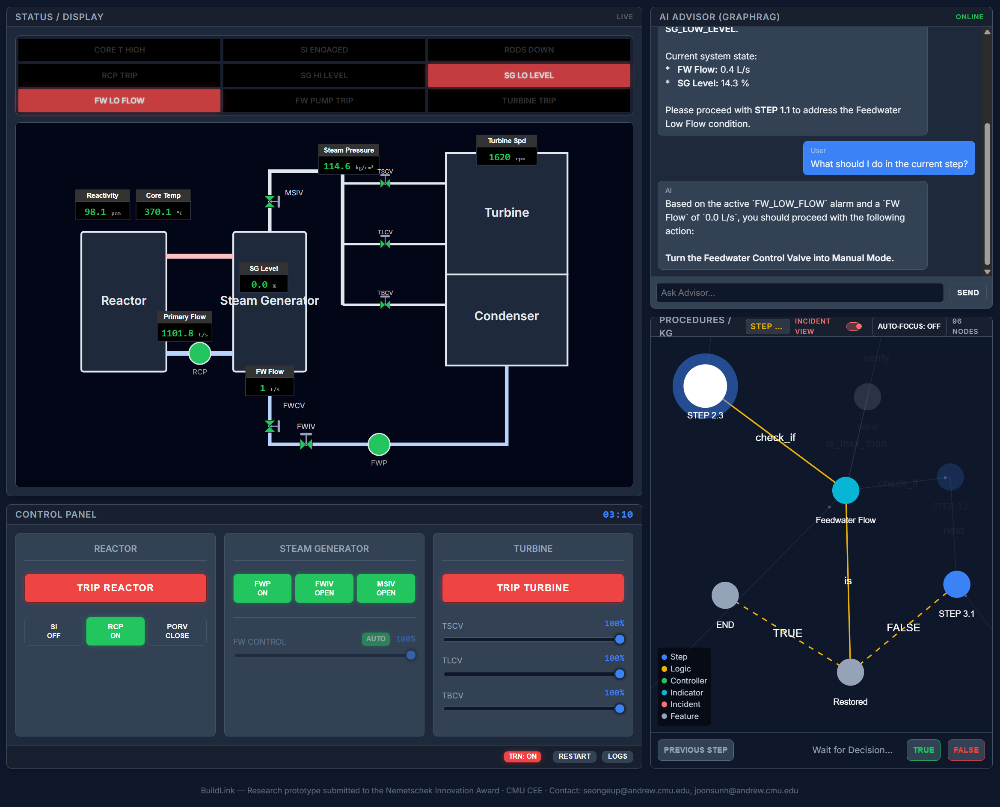

# BuildLink

**BuildLink — Research prototype submitted to the Nemetschek Innovation Award · CMU CEE**

Contact: Seongeun Park ([seongeup@andrew.cmu.edu](mailto:seongeup@andrew.cmu.edu)), Joonsun Hwang ([joonsunh@andrew.cmu.edu](mailto:joonsunh@andrew.cmu.edu))

BuildLink is a research prototype that provides **context-aware, queryable operational support** for complex infrastructure systems.
It integrates **graph-based procedural knowledge**, **AI-powered conversational assistance**, and an **interactive control-room-style interface**.

This repository includes a **live web-based demonstrator**, validated using a **nuclear power plant Loss of Feedwater (LOFW)** scenario as a representative safety-critical use case.


*Live web-based demonstrator showing the control room interface, AI advisor, and procedure knowledge graph.*

---

## 🔗 Links

* **Live Demonstrator:** [https://buildlink-drab.vercel.app/](https://buildlink-drab.vercel.app/)

---

## 🧠 What BuildLink Does

BuildLink supports human operators during abnormal or emergency situations by:

* Visualizing operational procedures as **knowledge graphs**
* Preserving **operator-driven decision-making**
* Providing **context-aware AI assistance** grounded in procedures and system state
* Enabling intuitive navigation of procedures, incidents, and system conditions

The system focuses on **making procedures visible and interpretable**, rather than automating operator actions.

---

## 🧪 Live Demonstrator: Nuclear Power Plant LOFW Scenario

The current prototype demonstrates BuildLink using a simulated **pressurized water reactor (PWR)** control environment.

### Supported Scenarios

* **Scenario A (cv):** Feedwater control valve malfunction
* **Scenario B (pump):** Feedwater pump trip
* **Scenario C (hard):** Total loss of feedwater requiring emergency shutdown

### Training Mode

* **Training Mode ON (default):**

  * Scenario C is enforced
  * Stochastic noise is added to system behavior
* **Training Mode OFF:**

  * Users may manually select Scenario A / B / C

---

## 🖥️ System Overview

The interface consists of four coordinated panels:

* **Status Panel:** Real-time system state, indicators, and alarms
* **Control Panel:** Operator actions, scenario selection, and mode control
* **AI Advisor:** RAG-based conversational assistant
* **Procedure Panel:** Graph-based visualization of operational procedures

---

## 🛠️ Technology Stack

* **Frontend:** React (Vite), TypeScript
* **State Management:** Zustand (physics + procedure logic)
* **Visualization:** react-force-graph-2d
* **AI:** Retrieval-Augmented Generation (RAG)
* **Backend:** FastAPI (Python)

---

## 🚀 Local Development

### Frontend

```bash
npm install
npm run dev
```

Frontend runs at:

```
http://localhost:5173
```

### Backend (required for AI features)

```bash
uvicorn backend.main:app --reload --port 8000
```

Backend runs at:

```
http://localhost:8000
```

> The frontend expects the backend server to be running locally.

---

## 📄 Notes

* This repository is intended as a **research prototype and live demonstrator**.
* Detailed problem formulation, technical contributions, and evaluation are described in the accompanying report submitted to the Nemetschek Innovation Award.
