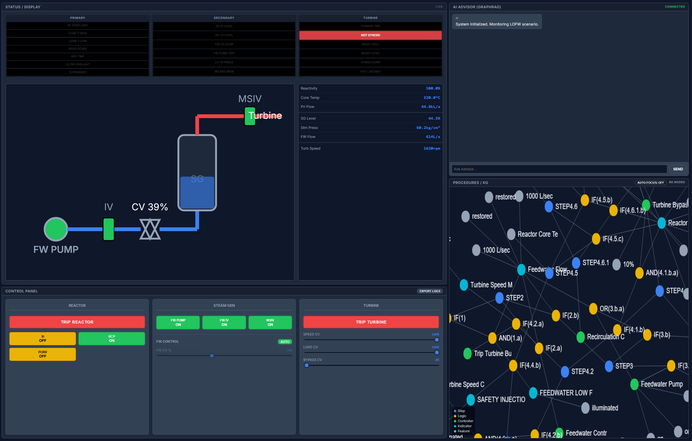

# Web-Based Nuclear Power Plant Simulator (LOFW Prototype)

## 1. Project Overview
This project aims to build a **Web-based Prototype** of a Nuclear Power Plant (NPP) simulator, specifically focusing on the **Loss of Feedwater (LOFW)** scenario. The goal is to provide a simplified, accessible platform for industry partners to test and validate our approach without the friction of installing desktop executables.

### Key Objectives
- **Prototype (MVP):** Rapid development of a minimum viable product.
- **Scenario:** Loss of Feedwater (LOFW).
- **Platform:** Web-based (React) for easy distribution and testing.
- **Physics:** Simplified "Fake Physics" optimized for training and decision-making (not high-fidelity engineering analysis).

---

## 2. Context & Design Decisions
*(Derived from project logs 2025-2026)*

- **Web vs. EXE:** We chose a web-based approach to allow decision-makers to easily test the prototype via a URL. If adopted, the core logic can be ported to EXE later if needed.
- **Control Panel:** Simplified design. We explicitly rejected using the complex RANCOR system directly to avoid unnecessary complexity and generalizability issues.
- **Layout:** A **4-Split Panel** design was chosen to balance situational awareness, control, and future AI integration.

---

## 3. System Architecture (4-Split Layout)

The application interface is divided into four quadrants:

| Quadrant | Panel Name | Functionality |
| :--- | :--- | :--- |
| **Top-Left** | **Status/Display Panel** | **(Read-Only)** Visualizes the plant state (Mimic Diagram). Shows key metrics like FW Flow, SG Level, SG Pressure, Reactor Power, Turbine Speed, and Alarm Tiles. |
| **Bottom-Left** | **Control Panel** | **(Interactive)** Operator controls including Toggles (Pump, Valves), Sliders (Control Valve), and Buttons (Trip). |
| **Top-Right** | **AI Advisor** | *(Placeholder)* Area for future AI-based decision support and Chatbot. |
| **Bottom-Right** | **Procedures/KG** | *(Placeholder)* Area for interactive procedures and Knowledge Graph visualization. |



---

## 4. Simulation Model ("Fake Physics")
The simulation does not use complex thermal-hydraulic codes. Instead, it uses simplified ODEs to mimic the *behavior* required for training and decision-making.

### State Variables
- `fw_flow` (kg/s)
- `sg_level` (%)
- `sg_pressure` (MPa or relative value)
- `reactor_power` (%)
- `turbine_speed` (rpm or %)

### Control Inputs
- **Toggles:**
  - `fw_pump_on` (Boolean)
  - `fw_iv_open` (Boolean) - Isolation Valve
  - `msiv_open` (Boolean) - Main Steam Isolation Valve
- **Sliders:**
  - `fw_cv` (0.0 to 1.0) - Control Valve
- **Buttons:**
  - `TRIP REACTOR`
  - `TRIP TURBINE`

### Update Logic (approx. 10Hz)
The core dynamics are governed by:

```javascript
// Feedwater Flow Calculation
fw_flow = k * fw_pump_on * fw_iv_open * fw_cv * (1 - fault_severity)

// Steam Generator Level Dynamics
// level increases with inflow, decreases with steam outflow
sg_level += a * fw_flow - b * steam_out
// Note: steam_out is derived from reactor power/pressure
```

### Alarms
- `FW LOW FLOW`
- `SG LOW LEVEL`
- `RX OVER PWR` (Optional)
- `HIGH ΔT` (Optional)

---

## 5. Logging System
Logging is a critical requirement for future analysis and Knowledge Graph construction.

### 1. Event Logs
Records every user interaction.
- **Format:** `{ timestamp, action_type, target, value, user_id }`
- **Examples:**
  - `SET_FW_CV 0.65`
  - `TOGGLE_PUMP ON`
  - `PRESS_TRIP_REACTOR`

### 2. State Snapshots
Records the full system state every **1 second (1Hz)**.
- **Fields:** `fw_flow`, `sg_level`, `sg_pressure`, `power`, `alarms[]`

---

## 6. Technical Stack
- **Frontend:** React
- **State Management:** Zustand (Lightweight store for simulation state)
- **Visualization:** Canvas or SVG (for Mimic Diagram/P&ID)
- **Deployment:** Vercel/Netlify (Static)

---

## 7. Development Plan

### Day 1: UI & Basics
- Implement the 4-split layout.
- Create UI components for Controls (Toggles, Sliders).
- Implement the Status Panel with dummy data.

### Day 2: Physics & Alarms
- Implement the "Fake Physics" loop (ODEs).
- Connect Controls to State.
- Implement Alarm logic (Thresholds).

### Day 3: Logging & Export
- Implement Event Logging.
- Implement State Snapshotting (1Hz).
- Create "Incident Report" JSON export feature.
